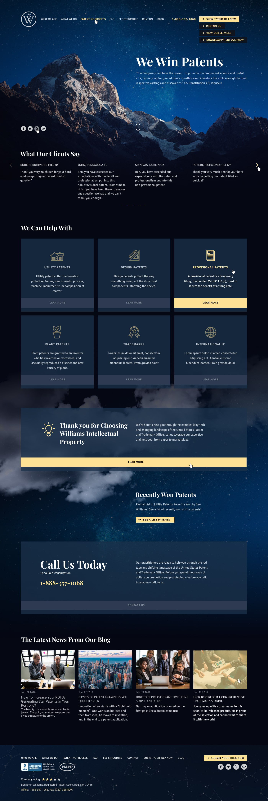
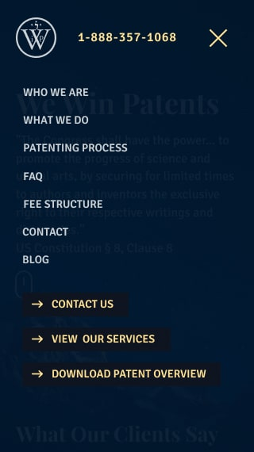
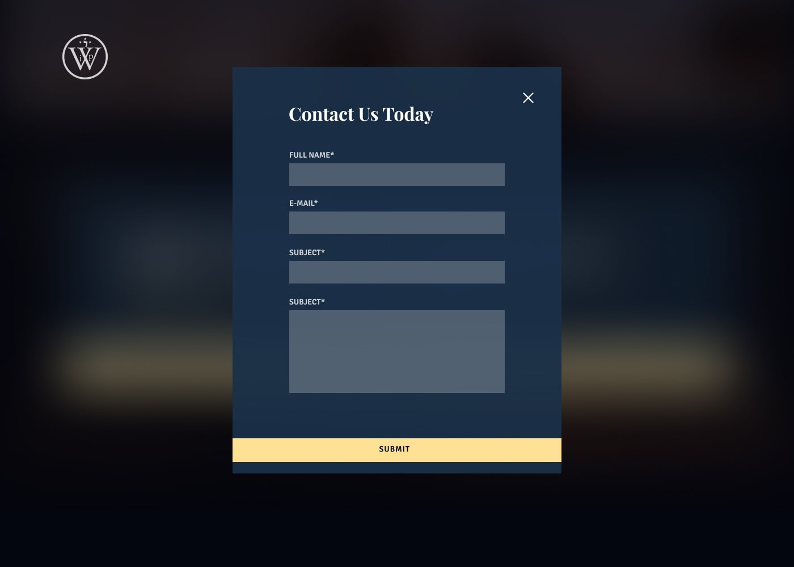
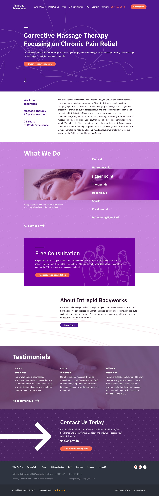
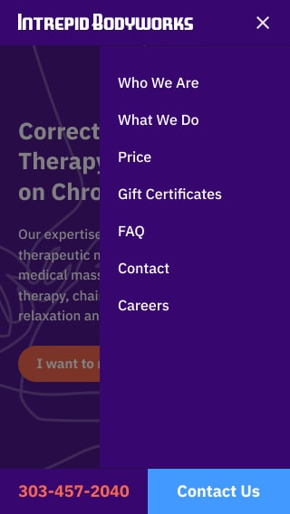
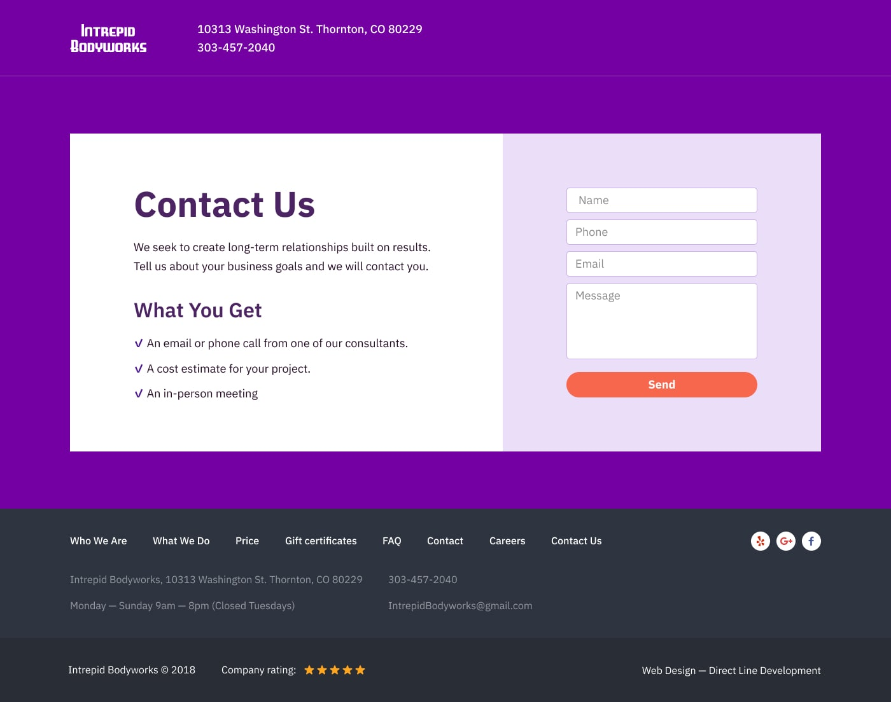
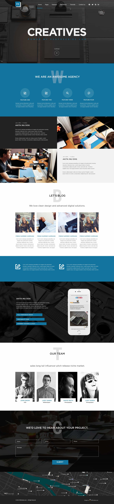
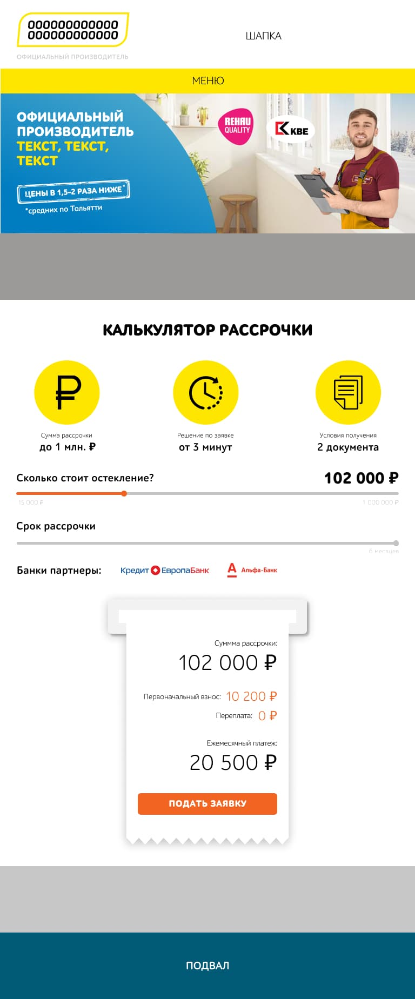
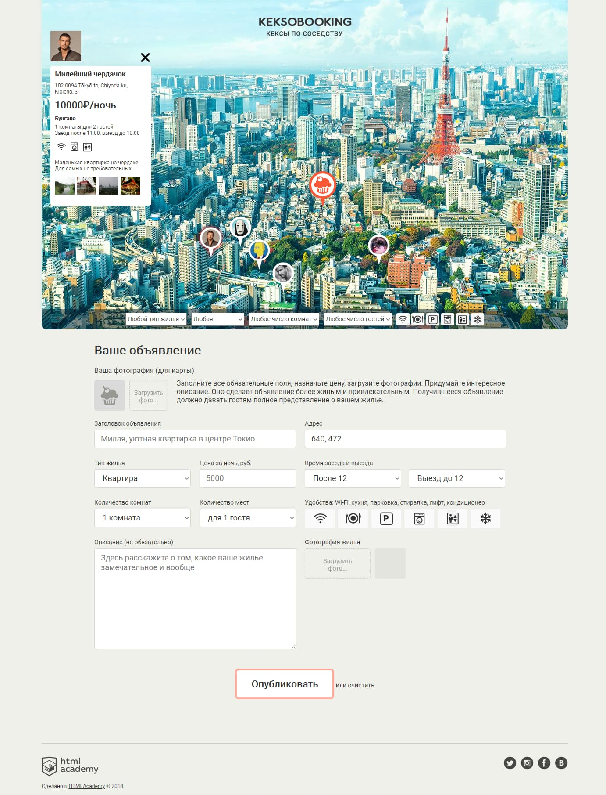

# Проекты в портфолио:
## Williams Intellectual Property
[Website](https://mrtoshkin.github.io/Williams-Intellectual-Property "mrtoshkin.github.io/williams-intellectual-property") | [Github](https://github.com/mrtoshkin/Williams-Intellectual-Property "github.com/mrtoshkin/williams-intellectual-property") - сайт патентного агентства (22 страницы).

Использованы: git, pug, scss, js, jquery, gulp, БЭМ, mobile first.

Вёрстка на флексах, не резиновый.

Реализован sticked burger menu в мобильной версии. Параллакс эффект фона. Поддержка ретины 2x и формата webp, уменьшенные и кропированные для телефонов. svg4everybody и полифилы.

---
## Intrepid Bodyworks
[Website](https://mrtoshkin.github.io/Intrepid-Bodyworks "mrtoshkin.github.io/intrepid-bodyworks") | [Github](https://github.com/mrtoshkin/Intrepid-Bodyworks "github.com/mrtoshkin/intrepid-bodyworks") -  сайт массажной компании (17 страниц).

Использованы: git, pug, scss, js, jquery, gulp, БЭМ, desktope first.

Вёрстка на флексах и гридах, резиновый.

Стилизованная карта google, Поддержка формата webp, уменьшенные и кропированные для телефонов, адаптивность к размеру экрана и поддержки формата, svg4everybody и полифилы.

---

## Creative Digital Agencies
[Website](https://mrtoshkin.github.io/Creative-Digital-Agencies "mrtoshkin.github.io/creative-digital-agencies") | [Github](https://github.com/mrtoshkin/creative-digital-agencies "github.com/mrtoshkin/creative-digital-agencies") - одностраничный лэндинг на bootstrap 4.5

---

## Тестовое задание в компанию Crest
[Website](https://mrtoshkin.github.io/vacancy-crest "mrtoshkin.github.io/vacancy-crest") | [Github](https://github.com/mrtoshkin/vacancy-crest "github.com/mrtoshkin/vacancy-crest")

---

## Keksobooking
[Website](https://mrtoshkin.github.io/keksobooking "mrtoshkin.github.io/keksobooking") | [Github](https://github.com/mrtoshkin/keksobooking "github.com/mrtoshkin/keksobooking") - личный проект обучения 1 уровня JS от HTML Academy.

---

## Code And Magick
[Website](https://mrtoshkin.github.io/Code-And-Magick "mrtoshkin.github.io/code-and-magick") | [Github](https://github.com/mrtoshkin/code-and-magick "github.com/mrtoshkin/code-and-magick") - учебный проект 1 уровня JS от HTML Academy.